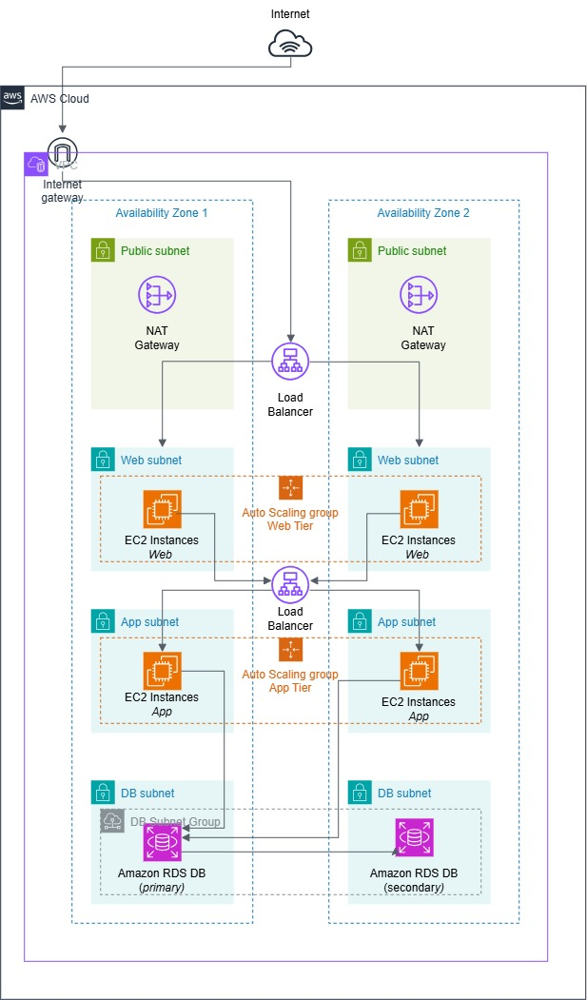
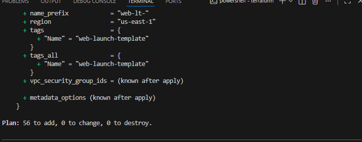

# AWS Three-Tier Web Application Architecture

Three-tier web application architecture on AWS, provisioned entirely with Terraform. The design separates a web tier (Nginx), an application tier (Node.js), and a database tier (RDS PostgreSQL) into isolated network segments, replicated across two Availability Zones.

---

## Overview

This project provisions a VPC spanning two Availability Zones, with four subnet tiers (public, private-web, private-app, and isolated-db) each duplicated across both AZs for high availability. Traffic flows from the internet through an external Application Load Balancer to an Nginx web tier, then through an internal, non-internet-facing Application Load Balancer to a Node.js application tier, and finally to an isolated Multi-AZ RDS PostgreSQL database unreachable from the internet at both the network and security-group layers.

---

## Architecture Diagram



**Trust boundaries:**

| Zone | Subnets | Contains | Internet Access |
|---|---|---|---|
| Public | 2 (one per AZ) | External ALB, NAT Gateways | Direct, via Internet Gateway |
| Private — Web | 2 (one per AZ) | Nginx (Auto Scaling Group) | Outbound only, via NAT Gateway |
| Private — App | 2 (one per AZ) | Node.js (Auto Scaling Group), Internal ALB | Outbound only, via NAT Gateway |
| Isolated — DB | 2 (one per AZ) | RDS PostgreSQL (Multi-AZ) | None — no route to 0.0.0.0/0 |

**Request flow:**

```
Internet
   |
   v
Internet Gateway
   |
   v
External ALB (public subnets, both AZs)
   |  HTTPS :443 -> HTTP :80
   v
Nginx - Web Tier ASG (private-web subnets, both AZs)
   |  HTTP :80
   v
Internal ALB (no public IP, private-web subnets)
   |  HTTP :80
   v
Node.js - App Tier ASG (private-app subnets, both AZs)
   |  TCP :5432
   v
RDS PostgreSQL - Multi-AZ (isolated-db subnets, both AZs)
```

**Outbound-only path** (Used for OS package updates on EC2 instances):

```
Private-Web / Private-App subnets -> NAT Gateway (per AZ) -> Internet Gateway -> Internet
```

---

## Repository Structure

```
terraform/
├── main.tf                       
├── variables.tf                  
├── outputs.tf                   
├── providers.tf                 
├── terraform.tfvars.example     
│
└── modules/
    ├── networking/
    │   ├── main.tf                
    │   ├── variables.tf
    │   └── outputs.tf
    │
    ├── security-groups/
    │   ├── main.tf                
    │   ├── variables.tf
    │   └── outputs.tf
    │
    ├── alb/
    │   ├── main.tf                 
    │   ├── variables.tf
    │   └── outputs.tf
    │
    ├── asg/
    │   ├── main.tf                
    │   ├── variables.tf
    │   └── outputs.tf
    │
    └── rds/
        ├── main.tf                
        ├── variables.tf
        └── outputs.tf
```

---

## Prerequisites

- An AWS account with credentials configured (`aws configure`)
- Terraform
- An ACM certificate ARN for the external ALB's HTTPS listener (see [Known Limitations](#known-limitations))

---

## How to Deploy

```bash
git clone <this-repository-url>
cd terraform

# Copy the example vars file and fill in real values
cp terraform.tfvars.example terraform.tfvars

terraform init
terraform fmt
terraform validate
terraform plan
terraform apply
```

### Expected Output



To tear everything down:

```bash
terraform destroy
```

---

## Variables

| Variable | Description | Default |
|---|---|---|
| `aws_region` | AWS region to deploy into | `us-east-1` |
| `db_username` | Master username for the RDS instance | - (required) |
| `web_instance_type` | EC2 instance type for the web tier | `t3.micro` |
| `app_instance_type` | EC2 instance type for the app tier | `t3.micro` |
| `acm_certificate_arn` | ARN of an ACM certificate for HTTPS on the external ALB | `""` (must be supplied) |

The database master password is **not** a variable — see [Design Decisions](#design-decisions) below.

---

## Outputs

| Output | Description |
|---|---|
| `vpc_id` | ID of the created VPC |
| `external_alb_dns_name` | Public DNS name of the external ALB |
| `rds_endpoint` | Connection endpoint for the RDS instance |
| `db_secret_arn` | ARN of the Secrets Manager secret holding the database password |

---

## Module Deep Dive

`modules/networking`

Builds the VPC (`10.0.0.0/16`) and eight subnets across two Availability Zones — 2 public, 2 private-web, 2 private-app, and 2 isolated-db. Attaches an Internet Gateway to the VPC and one NAT Gateway per AZ, each sitting in that AZ's own public subnet with its own Elastic IP. Defines four route tables: one shared by both public subnets (routing `0.0.0.0/0` to the Internet Gateway), one per AZ for that AZ's private-web and private-app subnets (each routing `0.0.0.0/0` to that AZ's own NAT Gateway, not the other AZ's), and one for the DB subnets with no internet route at all. Outputs the VPC ID and every subnet-ID list the other modules need.

`modules/security-groups`

Defines five security groups, one per trust boundary: `external_alb_sg`, `web_sg`, `internal_alb_sg`, `app_sg`, `db_sg`. Every ingress rule after the internet-facing edge references the previous tier's security group ID rather than a CIDR block. `db_sg` has an ingress rule from `app_sg` on port 5432 and no egress rules at all, since RDS never needs to initiate outbound traffic. `web_sg` and `app_sg` each carry one deliberate exception. They carry  outbound HTTPS to `0.0.0.0/0` so EC2 instances can get OS updates via NAT. 

`modules/alb`

Creates two Application Load Balancers. The external ALB sits in the public subnets, is internet-facing, and listens on both 443 (HTTPS, forwarding to the web target group) and 80 (which only issues a 301 redirect to 443). The internal ALB has `internal = true`, giving it no public IP, and sits in the private-web subnets listening on plain HTTP 80, forwarding to the app target group. Each ALB has its own target group with a `/health` health check, and each target group is what the corresponding ASG registers its instances into. Outputs both ALBs' DNS names and both target groups' ARNs.

`modules/asg`

One module, called twice from the root (once for web, once for app) with different variables each time, rather than duplicated as two separate modules. Contains a `data "aws_ami"` lookup that resolves the latest Amazon Linux 2023 image at every plan/apply, so the deployment always uses a current, patched image. A launch template references that AMI along with the tier's instance type and security group. An Auto Scaling Group reads the launch template, creates instances across the subnet IDs passed in, registers each instance into the target group ARN passed in, and maintains the configured min/max/desired count replacing any instance that fails its health check without manual intervention.

`modules/rds`

Creates a DB subnet group spanning both isolated-db subnets. The RDS instance runs PostgreSQL 16.15 on `db.t3.micro`, with `storage_encrypted = true` for encryption at rest and `manage_master_user_password = true` so AWS generates and stores the master password in Secrets Manager rather than accepting one as a Terraform variable. Attached to `db_sg` from the security-groups module and placed in the DB subnet group, with no public accessibility and no route to the internet at the network layer underneath it. Outputs the connection endpoint and the Secrets Manager secret's ARN.

---

## Design Decisions

**Four subnet tiers, not three.** The scenario names three tiers i.e web, app, database but each is a distinct trust boundary with different traffic rules, so each gets its own subnet tier: public (internet-facing infrastructure only), private-web, private-app, and isolated-db.

**Two Application Load Balancers, not one.** A single ALB serving both tiers would need to be internet-facing to receive traffic at all. The external ALB is public and only ever talks to the web tier. The internal ALB (`internal = true`) has no public IP and is only reachable from inside the VPC, so the app tier is unreachable except through the web tier.

**Every security group references the security group before it, never a CIDR block, past the internet-facing edge.** External ALB accepts `0.0.0.0/0` on 443/80 because it has to. Every rule after that references a specific security group ID: web tier only accepts traffic from the external ALB's security group, the internal ALB only accepts from the web tier's security group, the app tier only accepts from the internal ALB's security group, and the database only accepts from the app tier's security group on port 5432. This means a security group rule alone enforces the tier chain.

**The database security group has no egress rules at all.** RDS never needs to initiate an outbound connection. It only ever responds to queries sent to it. Blocking all outbound traffic costs nothing functionally and closes off any path for a compromised database to reach out to the internet or another part of the network.

**Database credentials are managed by AWS Secrets Manager, not a Terraform variable.** The RDS instance is created with `manage_master_user_password = true`, which tells AWS to generate the master password itself and store it in Secrets Manager. The password never exists in a `.tf` file, a `.tfvars` file, or Terraform state as plaintext. The instance's `master_user_secret` attribute exposes the secret's ARN as an output, which an application would use to retrieve the credential at runtime via the Secrets Manager API. This is a stronger guarantee than a gitignored `.tfvars` file, since there is no password variable anywhere in the codebase to accidentally commit.

**Encryption at rest and in transit.** `storage_encrypted = true` on the RDS instance encrypts the database and its automated backups using AWS-managed KMS keys. The external ALB terminates TLS using the supplied ACM certificate; a listener on port 80 exists solely to issue a 301 redirect to port 443, so no unencrypted content is ever served. Traffic between the ALBs and the EC2 tiers, and between the app tier and RDS, travels over the private VPC network rather than the public internet.

**AMI selection via a data source, not a hardcoded ID.** The Auto Scaling Group's launch template resolves its AMI through a `data "aws_ami"` lookup for the latest Amazon Linux 2023 image, filtered by owner and name pattern. This re-resolves on every `plan`/`apply`, so the deployment always uses the current, patched AMI rather than a fixed ID that would eventually go stale or miss security updates.

**Auto Scaling Groups provide high availability for compute, Multi-AZ provides it for the database.** Each ASG spans both AZs' private subnets and maintains a minimum instance count, replacing any instance that fails a health check or is otherwise lost making the web and app tiers self healing. RDS Multi-AZ maintains a synchronously-replicated standby in the second AZ; if the primary's AZ fails, RDS fails over to the standby automatically, with no data loss for committed transactions.

**The app tier uses an IAM role to retrieve the database password.** The RDS master password lives in the AWS Secrets Manager (via `manage_master_user_password = true`). The App tiers EC2 instances assume an IAM role with a single permission: `secretsmanager:GetSecretValue` on the RDS secret's ARN. The App tier can retrieve the one secret it needs. No credentials are embedded on the AMI, the launch template or Terraform file.  
